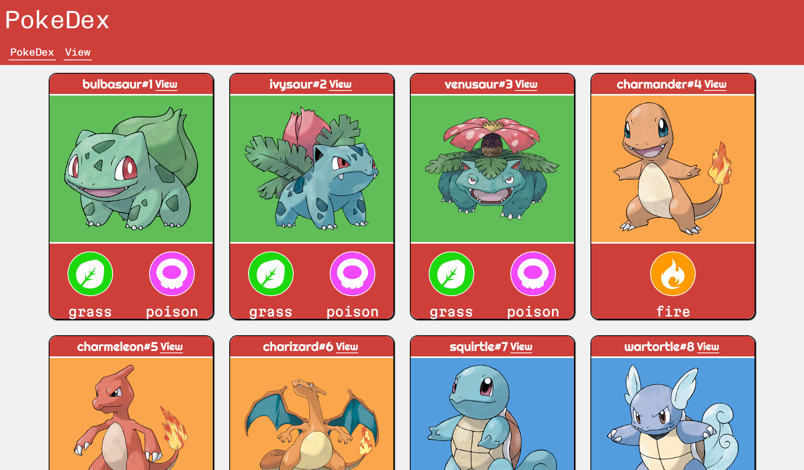
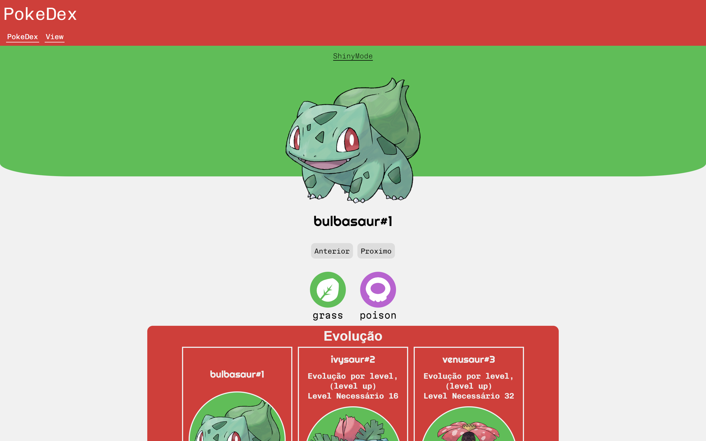

<h1 align="center">Pokedex</h1>
 
 
<b>Um site que mostrar todos os 1008 pokemon da pokedex usando a</b>

 

 

 
<a href="https://diegoarauj0.github.io/PokeDex/" target="_black">acesse o site por esse link</a>

 

 

 

 

